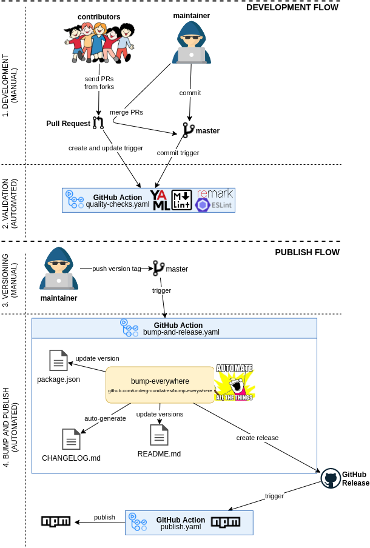

# eslint-config-disable-bad-rules

[](https://erkinekici.com/articles/linting-trap/)

[](https://www.npmjs.com/package/eslint-config-disable-bad-rules)
[](https://github.com/undergroundwires/bump-everywhere)
[](https://github.com/undergroundwires/eslint-config-disable-bad-rules/actions/workflows/quality-checks.yaml)
[](https://github.com/undergroundwires/eslint-config-disable-bad-rules/actions/workflows/publish.yaml)
[](https://github.com/undergroundwires/eslint-config-disable-bad-rules/actions/workflows/bump-and-release.yaml)

## Overview

It turns off ESLint rules that makes you write worse code. It prevents your code to become more insecure or less maintainable. It allows you to use any rule set you wish with confidence that you disable the bad rules from them.

It mitigates security and maintainability risks introduced by collections such as [Airbnb](https://github.com/airbnb/javascript), [standard](https://github.com/standard/eslint-config-standard), [eslint-config-alloy](https://github.com/AlloyTeam/eslint-config-alloy), Facebook ([create-react-app](https://github.com/facebook/create-react-app), [facebook/fbjs](https://github.com/facebook/fbjs/)), [Canonical](https://github.com/gajus/eslint-config-canonical), [Spotify](https://github.com/spotify/web-scripts/), [Wikimedia](https://github.com/wikimedia/eslint-config-wikimedia) and [XO](https://github.com/xojs/eslint-config-xo).

It's based on article [Linting trap](http://erkinekici.com/articles/linting-trap):

> It considers two aspects as more prioritized than others:
>
> 1. Smaller security vulnerability surface.
> 2. Easier future changes.

## Usage

1. Install:
   `npm install --save-dev eslint-config-disable-bad-rules`

2. Configure your project in `.eslintrc.{js,yml,json}` file:

  ```js
    {
      // ...
      "extends": [

        // Other rules that activate rules
        // E.g. "airbnb", "canonical", "prettier"

        "disable-bad-rules" // Keep as last configuration
      ]
    }
  ```

## GitOps for this repository


